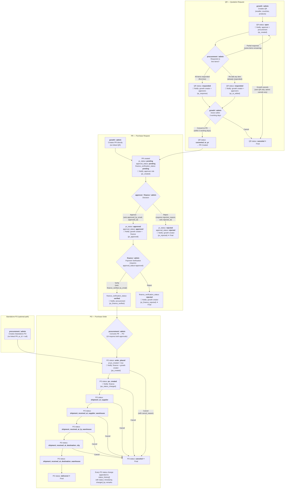
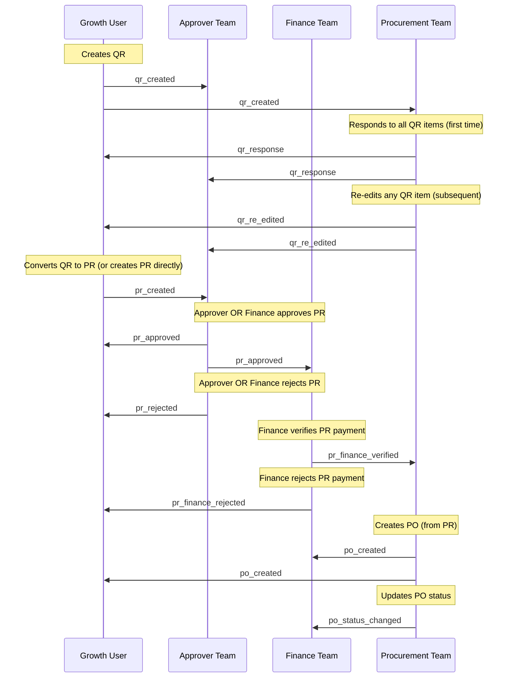

# 360 Portal - Complete Role-Based Workflow

## Full QR → PR → PO Lifecycle Flowchart



## Who Does What — Role Summary

**Roles:** `growth`, `approver`, `finance`, `procurement`, `admin`

- **QR**
  - Created by: `growth` (own) or `admin`
  - Responded to by: `procurement` or `admin` — per-item `submittedAt` / `lastEditedAt` tracked inside `procurement_response` JSONB; `_metadata.editCount` incremented on each re-edit
  - Cancelled by: `growth` (own only) or `admin`
  - Converted to PR by: `growth` (own, within 3 working days of last response/re-edit) or `admin`
- **PR**
  - Created by: `growth` or `admin` (directly or via QR conversion)
  - Approved/Rejected by: `approver`, **`finance`**, or `admin` — fields set: `approved_by_email`, `approved_at`, `approval_remarks` (approve); `rejection_reason`, `rejected_at` (reject)
  - Finance Verified/Rejected by: `finance` or `admin` — fields set: `finance_verified_by_email`, `reference_files`
  - Converted to PO by: `procurement` or `admin` (UI guards require both `approval_status=approved` AND `finance_verification_status=verified`)
- **PO**
  - Created by: `procurement` or `admin` (from PR, or standalone with `pr_id = null`)
  - Status updated by: `procurement` or `admin` — every change appended to `status_history[]` JSONB array with `status`, `timestamp`, `changed_by`, `remarks`

## Notification Flow



## Action History Tracking

| Document | How Actions Are Tracked |
| -------- | ----------------------- |
| QR | Per-item `submittedAt` / `lastEditedAt` inside `procurement_response` JSONB; `_metadata.editCount`, `_metadata.firstSubmittedAt`, `_metadata.lastEditedAt` |
| PR | Dedicated audit fields per actor: `approved_by_email`, `approved_at`, `approval_remarks`, `rejection_reason`, `rejected_at`, `finance_verified_by_email`, `reference_files` |
| PO | `status_history[]` JSONB array — every status change gets an entry with `status`, `timestamp`, `changed_by`, `remarks` |

## Access Control Matrix

| Feature | Growth | Approver | Finance | Procurement | Admin |
|---------|--------|----------|---------|-------------|-------|
| **QR - View** | Own only | All (RO) | ❌ None | All | All |
| **QR - Create** | ✅ Yes | ❌ No | ❌ No | ❌ No | ✅ Yes |
| **QR - Respond** | ❌ No | ❌ No | ❌ No | ✅ Yes | ✅ Yes |
| **QR - Cancel** | Own only | ❌ No | ❌ No | ❌ No | All |
| **QR - Convert to PR** | Own only (3-day window) | ❌ No | ❌ No | ❌ No | All |
| **PR - View** | Own only | All | Approved only | All | All |
| **PR - Create** | ✅ Yes | ❌ No | ❌ No | ❌ No | ✅ Yes |
| **PR - Approve/Reject** | ❌ No | ✅ Yes | ✅ Yes | ❌ No | ✅ Yes |
| **PR - Finance Verify** | ❌ No | ❌ No | ✅ Yes | ❌ No | ✅ Yes |
| **PR - Convert to PO** | ❌ No | ❌ No | ❌ No | ✅ Yes† | ✅ Yes |
| **PO - View** | Own only (RO) | All (RO) | All | All | All |
| **PO - Create (standalone)** | ❌ No | ❌ No | ❌ No | ✅ Yes | ✅ Yes |
| **PO - Update Status** | ❌ No | ❌ No | ❌ No | ✅ Yes | ✅ Yes |

†UI enforces both `approval_status=approved` AND `finance_verification_status=verified` before showing the Convert button

## Status Transitions

### QR Status (`qr.status`)
```
open ──────────────────────────────────────────────► canceled
  │   (growth/admin cancels at any point while open)
  │
  ▼  (procurement responds to all items)
responded ──────────────────────────────────────────► canceled
  │         (growth/admin cancels)
  │
  ▼  (growth converts within 3 working days)
converted_to_pr  ✦ Final
```

### PR Approval Status (`pr.approval_status`)
```
pending ──► approved ──► (finance verification proceeds)
        ╲
         ──► rejected  ✦ Final
```

### PR Finance Verification Status (`pr.finance_verification_status`)
```
pending ──► verified ──► (procurement converts to PO)
        ╲
         ──► rejected  ✦ Final
```

### PR Status (`pr.pr_status`) — mirrors approval_status in current code
```
pending → approved → rejected
(payment_verified and converted_to_po defined in types; not yet set by any API)
```

### PO Status (`po.status`)
```
order_placed
  → po_created
  → shipment_at_supplier
  → shipment_received_at_supplier_warehouse
  → shipment_received_at_lp_warehouse
  → shipment_received_at_destination_city
  → shipment_received_at_destination_warehouse
  → delivered  ✦ Final

Any status above can transition to:
  → canceled  ✦ Final
```

## Key Business Rules

1. **QR 3-Day Window**: Growth can convert a QR to PR only within 3 working days (Mon–Fri) of the last procurement response or re-edit. After that, rates must be reconfirmed.
2. **PR Creation**: Only `growth` (or `admin`) can create PRs; `procurement` cannot.
3. **Dual Approval Gate**: `approver` **and** `finance` roles can both approve/reject PRs at the approval step. Finance verification is a separate second step (finance-only).
4. **Double Gate for PO Conversion**: UI requires both `approval_status=approved` AND `finance_verification_status=verified` before the Convert to PO action is available.
5. **Finance Filter**: Finance users only see PRs with `approval_status=approved`.
6. **PO Ownership**: Growth users see only POs linked to their own PRs.
7. **Admin Override**: Admin bypasses all role restrictions and ownership filters.
8. **Immutable History**: Every PO status change is appended (never overwritten) to `status_history[]`.
9. **Notification Routing**: Notifications target specific email addresses — role-broadcast via `getUsersByRole()` or direct to document creator.
10. **Re-edit Notification**: When procurement edits an already-responded QR item, a `qr_re_edited` notification fires (distinct from `qr_response`).

## Key Files

| Layer | File |
| ----- | ---- |
| Types | `src/types/workflows.ts` |
| Notifications | `src/lib/notifications.ts` |
| QR create | `app/api/growth/qr/create/route.ts` |
| QR respond | `app/api/procurement/qr/[id]/respond/route.ts` |
| QR cancel/status | `app/api/growth/qr/[id]/status/route.ts` |
| PR create | `app/api/growth/pr/create/route.ts` |
| PR approve | `app/api/approver/pr/[id]/approve/route.ts` |
| PR reject | `app/api/approver/pr/[id]/reject/route.ts` |
| Finance verify | `app/dashboard/finance/pr/[id]/page.tsx` |
| PR → PO | `app/api/procurement/pr/[id]/convert/route.ts` |
| PO status update | `app/api/procurement/po/[id]/update-status/route.ts` |

## Verification Notes (Code vs. Diagram)

The following were confirmed or corrected against the actual source code:

| # | Finding | Impact |
|---|---------|--------|
| 1 | `finance` role can also approve/reject PRs (not just `approver`) — see `approve/route.ts` and `reject/route.ts` | Updated Access Control Matrix |
| 2 | QR re-edit fires `qr_re_edited` notification (separate from `qr_response`) | Added re-edit branch to flowchart |
| 3 | Finance verify action sets `finance_verified_by_email` but does **not** set `finance_verified_at` (field exists in type, not written by current code) | Noted in PR audit fields list |
| 4 | `pr_status` values `payment_verified` and `converted_to_po` exist in `PrStatus` type but no API sets them currently | Noted in Status Transitions |
| 5 | PO update-status route notifies only `finance`; does **not** notify Growth on status changes | Corrected notification sequence diagram |
| 6 | Standalone PO (`pr_id = null`) skips PR flow entirely and starts at `order_placed` | Added standalone PO subgraph |
| 7 | PR → PO conversion does not validate approvals in the API itself; validation is UI-enforced | Noted with `†` in Access Control Matrix |
